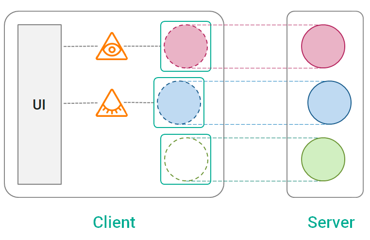
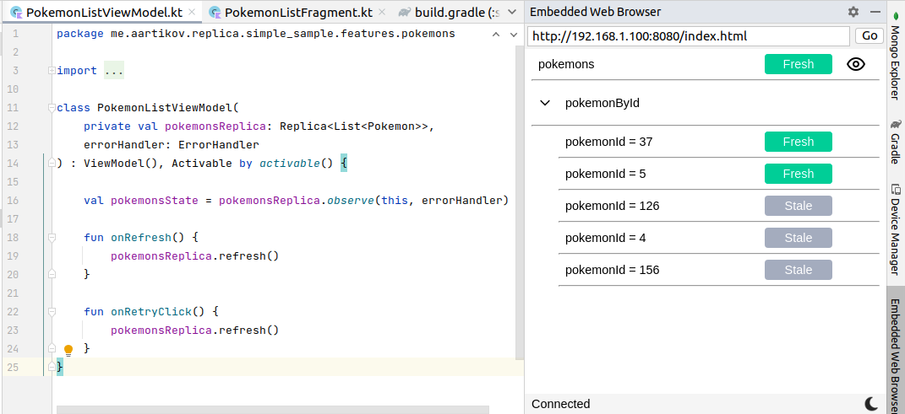
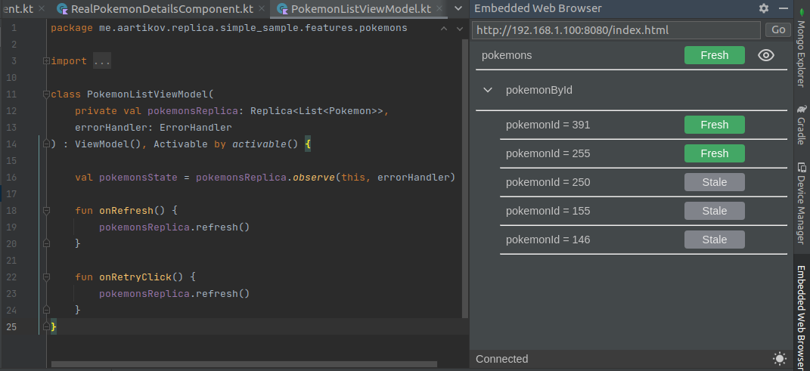

[](https://repo1.maven.org/maven2/com/github/aartikov/replica-core/)
[](https://opensource.org/licenses/MIT)
[](https://aartikov.github.io/Replica/)

<h1 align="center">Replica</h1>

<div align="center">
  KMM library for organizing of network communication in a declarative way.
</div>
<div align="center">
  <strong>Developed in <a href="https://mobileup.ru/">MobileUp</a> company.</strong>
</div>

## Motivation
While libraries such as *Retrofit* and *Kotlin Serialization* help to make network requests, Replica takes on another challenges.

It is important to keep data up to date on a client. But we shouldn't call network requests too frequently to not waste server resources.

Modern Android applications need sophisticated UX-patterns such as *stale-while-revalidate*, *pull-to-refresh*, *pagination* and *optimistic updates*. Developers have to implement it over and over again without the right tool at hand.

Classical imperative approach to networking is complex and error-prone. It is hard to achieve desired behavior by manually orchestrating individual network calls.

To summarize, Replica helps to:
1. **Keep client data up to date**
2. **Save server resources**
3. **Create great UX**
4. **Write simple and maintainable code**

## Features
Replica provides:
- Declarative approach to networking
- Independence from network frameworks (*Retrofit*, *Ktor*, *Apollo GraphQL* and so on)
- Automatic data loading based on active screens
- In-memory and on-disk caching
- Stale time configuration with automatic refresh
- Automatic request cancellation and old data clearing
- Request deduplication
- Sophisticated UX-patterns support
- Reaction on network connection status changes
- Combining data from several requests
- Integration with [ViewModel](https://developer.android.com/topic/libraries/architecture/viewmodel) and [Decompose](https://github.com/arkivanov/Decompose)
- Visual debug tool integrated to Android Studio
- KMM support

Planned features:
- Pagination

## Gradle Setup
```gradle
dependencies {

    def replicaVersion = '1.3.1-alpha1'

    // Basic usage
    implementation "com.github.aartikov:replica-core:$replicaVersion"

    // Automatic reaction on changes of network connection status
    implementation "com.github.aartikov:replica-android-network:$replicaVersion"

    // Transforming and combining replicas
    implementation "com.github.aartikov:replica-algebra:$replicaVersion"

    // Integration with ViewModel library
    implementation "com.github.aartikov:replica-view-model:$replicaVersion"

    // Integration with Decompose library
    implementation "com.github.aartikov:replica-decompose:$replicaVersion"

    // Debug tool
    debugImplementation "com.github.aartikov:replica-devtools:$replicaVersion"
    releaseImplementation "com.github.aartikov:replica-devtools-noop:$replicaVersion"
}
```

## How it works
The library is based on a concept called **data replication**. The idea is simple. There is some data on a server. A client needs this data. Replica automatically represent server data on a client side and keeps it in sync.

Replica provides data replication primitives called **replicas**. Each replica targets some chunk of data on a server and replicates it on a client.

And the last concept is **replica observers**. Replica observers are required to display data on UI. An observer connects to a replica and transfers its state to UI. A replica knows how many observers it has and performs complex behaviour based on this information.



## Basic usage
Typical code with Replica looks like that:

1. **Create a replica in Repository**

```kotlin
class PokemonRepository(
    replicaClient: ReplicaClient,
    api: PokemonApi
) {

    val pokemonsReplica: Replica<List<Pokemon>> = replicaClient.createReplica(
        name = "pokemons",
        settings = ReplicaSettings(staleTime = 1.minutes),
        fetcher = {
            api.getPokemons().toDomain()
        }
    )
}
```

2. **Observe a replica in ViewModel**
```kotlin
class PokemonListViewModel(
    private val pokemonsReplica: Replica<List<Pokemon>>,
    errorHandler: ErrorHandler
) : ViewModel(), Activable by activable() {

    val pokemonsState = pokemonsReplica.observe(this, errorHandler)

}
```

3. **Display state on UI**
```kotlin
viewLifecycleOwner.lifecycleScope.launch {
    repeatOnLifecycle(Lifecycle.State.STARTED) {
        viewModel.pokemonsState.collect { state ->
            val (loading, data, error) = state
            when {
                data != null -> {
                    // show a list of pokemons
                }
                loading -> {
                    // show a fullscreen progress
                }
                error != null -> {
                    // show a fullscreen error
                }
            }
        }
    }
}
```

## Replica DevTools

Replica has a debug tool integrated to Android Studio. It allows to monitor replicas, their states and observers.



Of course, dark theme is supported.




## Learn more
### Samples
- [Simple sample](https://github.com/aartikov/Replica/tree/main/simple-sample) - shows basic usage of Replica. 
- [Advanced sample](https://github.com/aartikov/Replica/tree/main/advanced-sample) - shows advanced techniques: observing data by dynamic key, optimistic updates, integration with [Decompose](https://github.com/arkivanov/Decompose). Architecture on this sample is based on [MobileUp Android Template](https://github.com/MobileUpLLC/MobileUp-Android-Template).

### Documentation
[Replica Documentation](https://aartikov.github.io/Replica/) - a website with detailed documentation (WIP).

## Contact the author
Artur Artikov

telegram - <a href="https://t.me/aartikov">@aartikov</a>, email - <a href="mailto:a.artikov@gmail.com">a.artikov@gmail.com</a>

## Special thanks
To <a href="https://github.com/EgoriusE">Egor Belov</a> for the help with Replica DevTools and Unit tests.

## License
```
The MIT License (MIT)

Copyright (c) 2023 Artur Artikov, Egor Belov
Permission is hereby granted, free of charge, to any person obtaining a copy
of this software and associated documentation files (the "Software"), to deal
in the Software without restriction, including without limitation the rights
to use, copy, modify, merge, publish, distribute, sublicense, and/or sell
copies of the Software, and to permit persons to whom the Software is
furnished to do so, subject to the following conditions:

The above copyright notice and this permission notice shall be included in all
copies or substantial portions of the Software.

THE SOFTWARE IS PROVIDED "AS IS", WITHOUT WARRANTY OF ANY KIND, EXPRESS OR
IMPLIED, INCLUDING BUT NOT LIMITED TO THE WARRANTIES OF MERCHANTABILITY,
FITNESS FOR A PARTICULAR PURPOSE AND NONINFRINGEMENT. IN NO EVENT SHALL THE
AUTHORS OR COPYRIGHT HOLDERS BE LIABLE FOR ANY CLAIM, DAMAGES OR OTHER
LIABILITY, WHETHER IN AN ACTION OF CONTRACT, TORT OR OTHERWISE, ARISING FROM,
OUT OF OR IN CONNECTION WITH THE SOFTWARE OR THE USE OR OTHER DEALINGS IN THE
SOFTWARE.
```
