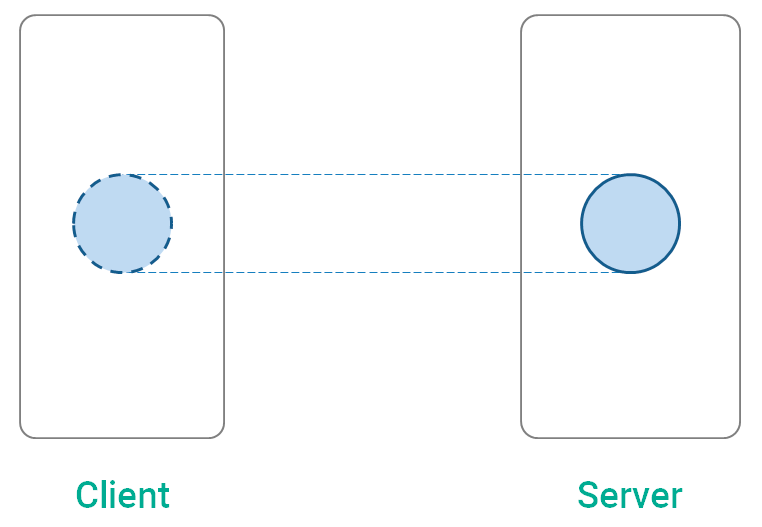
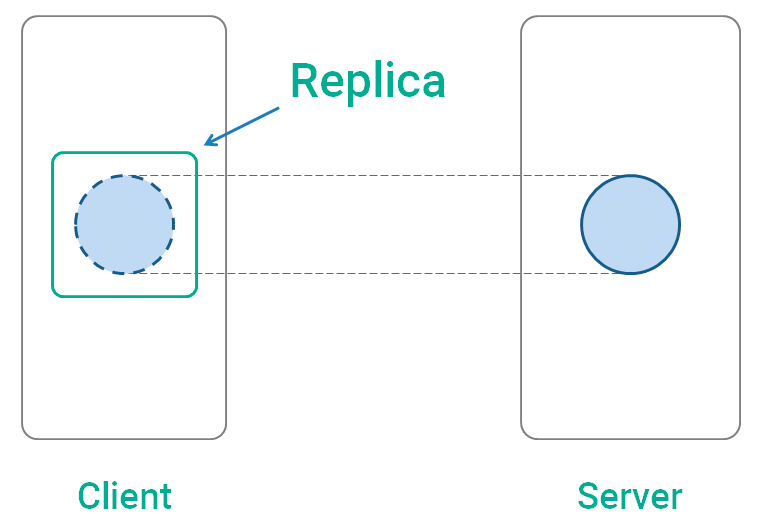
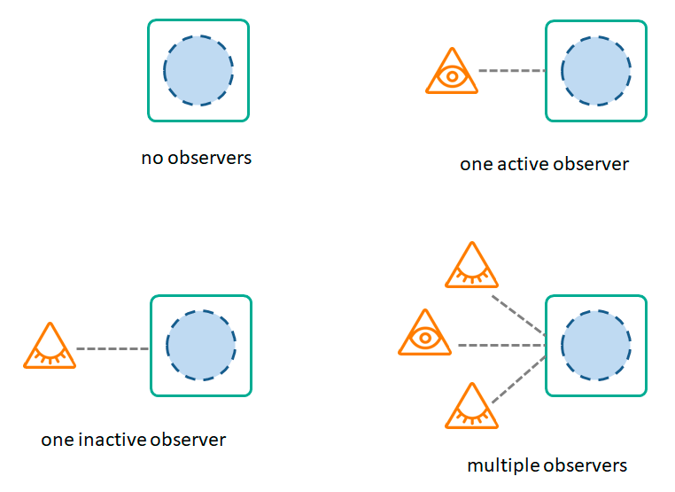
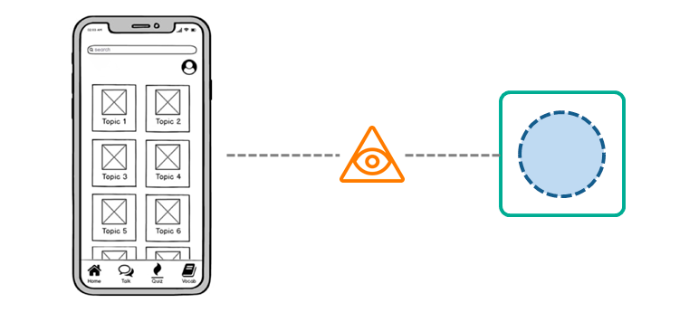
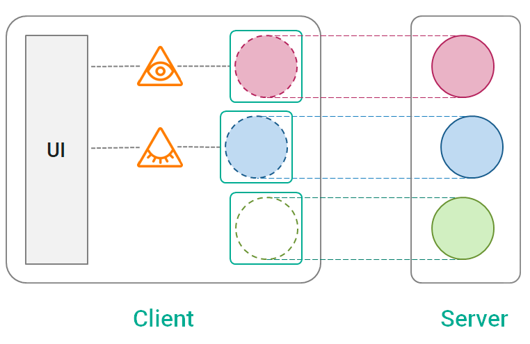

# Replica
[](https://repo1.maven.org/maven2/com/github/aartikov/replica-core/)
[](https://opensource.org/licenses/MIT)

#### Developed in [MobileUp](https://mobileup.ru/) company

## What is Replica?
**Replica** is an Android library for organizing of network communication. While libraries such as *Retrofit* and *Kotlin Serialization* help to make network requests, Replica takes on another challenges:

- Optimize amount of network calls
- Display up-to-date data
- Provide delightful User Experience (UX)
- Provide amazing Developer Experience (DX)

## How Replica works?
### Data Replication
The library is based on a concept called **data replication**. Imagine that there is some chunk of data on a server. The task of Replica is to make a copy of this data on a client. Sometimes data is changing on a server but Replica tries to keep it in sync.



### Replication primitives
Replica (a library) provides replication primitives called **replicas**. Replica (a replication primitive) is located on a client side and performs data replication.



### Replica Observers
**Replica observer** is an agent that connects to a replica and watches what is happening inside. Replica can have zero, one or multiple observers. Each observer can be **active** or **inactive**. By connecting to a replica an observer gets access to its state. A replica by itself knows how many active and inactive observers it has.



And the most important concept here is **A replica observer is associated with some UI screen.**



That means:
- When the screen is visible for an user, the replica has an active observer.
- When the screen is invisible (it is in a backstack or the whole app is in background), the replica has inactive observer.
- When an user leaves the screen by going back, the observer disconnects from the replica.

### Automatic behaviour
To replicate data a replica performs a quite complex automatic behaviour:
- Replica loads missing data when an active observer connects.
- Replica keeps track of data staleness.
- Replica refreshes stale data when an active observer is connected.
- Replica cancels network request when a last observer is disconnected.
- Replica clears data when it has no observers for a long time.

> **Note**
> This behaviour is implemented on a public library API so developers can add their own automatic logic.

### Let's summarize
For each chunk of data required from server a client has a corresponding replica. When a replica has an active observer it performs automatic data replication. The observed replica state gets to UI and displayed to an user.



## How to use Replica?

### Gradle Setup
First of all add a dependency to a Gradle script. Start with just `replica-core` and add other artifacts later as you need it.
```gradle
dependencies {

    def replicaVersion = '1.0.0-alpha6'

    // Basic usage
    implementation "com.github.aartikov:replica-core:$replicaVersion"

    // Automatic reaction on changes of network connection status
    implementation "com.github.aartikov:replica-android-network:$replicaVersion"

    // Transforming and combining replicas
    implementation "com.github.aartikov:replica-algebra:$replicaVersion"

    // Integration with ViewModel library
    implementation "com.github.aartikov:replica-view-model:$replicaVersion"

    // Integration with Decompose library
    implementation "com.github.aartikov:replica-decompose:$replicaVersion"

    // Debugging tool
    debugImplementation "com.github.aartikov:replica-devtools:$replicaVersion"
    releaseImplementation "com.github.aartikov:replica-devtools-noop:$replicaVersion"
}
```

### Create ReplicaClient
 **ReplicaClient** is required to create replicas. It should be a singleton.
```kotlin
val replicaClient = ReplicaClient()
```

### Create a repository with a replica

For example, lets create `PokemonRepository` to replicate a list of pokemons:

```kotlin
interface PokemonRepository {
    val pokemons: Replica<List<Pokemon>>
}
```


```kotlin
class PokemonRepositoryImpl(
    replicaClient: ReplicaClient,
    api: PokemonApi
) : PokemonRepository {

    override val pokemons: PhysicalReplica<List<Pokemon>> = replicaClient.createReplica(
        name = "pokemons",
        settings = ReplicaSettings(
            staleTime = 1.minutes
        ),
        fetcher = {
            api.getPokemons().toDomain()
        }
    )
}
```

We use `ReplicaClient.createReplica` to create a replica. The arguments of the method are:

- `name` - a human readable replica name, it can be used for debugging.
- `settings` - configures replica behaviour. In the example we configured that data became state after one minute since it was loaded. There are other settings in [ReplicaSettings](https://github.com/aartikov/Replica/blob/docs/replica-core/src/main/kotlin/me/aartikov/replica/single/ReplicaSettings.kt) but all these fields have default values.
- `fetcher` - configures how to load data from a network. In the example `PokemonApi` is powered by Retrofit but you can use any networking library you like.

> **Note**
> Once created a replica will exist as long as a replica client exists so don't create more than one replica for the same chunk of data.

Maybe you have noticed that in `PokemonRepository` the replica declared as `Replica` whereas in `PokemonRepositoryImpl` as `PhysicalReplica`. This is made on purpose. The difference between `Replica` and `PhysicalReplica` is that the latter has a richer API. `Replica` allows only read data, whereas `PhysicalReplica` has methods to cancel requests, modify data, execute optimistic updates. It is recommended to declare replicas in the presented way to make repositories more encapsulated.

### Connect an observer
Use `Replica.observe` to create a replica observer:
```kotlin
val pokemonsObserver = pokemonsReplica.observe(observerCoroutineScope, observerActive)
```

The arguments of the method are:

- `observerCoroutineScope` - is a coroutine scope that represents life time of an observer.
- `observerActive` - has type `StateFlow<Boolean>` and represents observer state - active/inactive.

Typically you should use a replica observer in a ViewModel. So for `observerCoroutineScope` you will pass `viewModelScope`. To track `observerActive` you should create `MutableStateFlow<Boolean>` in a ViewModel and set it to true/false when a Fragment is started/stopped.

### Display replica state
Once an observer is connected to a replica you can get replica state.
```kotlin
val pokemonsState = pokemonsObserver.stateFlow
```

Replica state has type `StateFlow<Loadable<T>>` where `Loadable<T>` is
```
data class Loadable<out T : Any>(
    val loading: Boolean,
    val data: T?,
    val error: CombinedLoadingError?
)
```

Pokemons UI can subscribe to `pokemonsState` and display loading, content or error depending on state.

## Contact the author
Artur Artikov <a href="mailto:a.artikov@gmail.com">a.artikov@gmail.com</a>

## License
```
The MIT License (MIT)

Copyright (c) 2022 Artur Artikov, Egor Belov
Permission is hereby granted, free of charge, to any person obtaining a copy
of this software and associated documentation files (the "Software"), to deal
in the Software without restriction, including without limitation the rights
to use, copy, modify, merge, publish, distribute, sublicense, and/or sell
copies of the Software, and to permit persons to whom the Software is
furnished to do so, subject to the following conditions:

The above copyright notice and this permission notice shall be included in all
copies or substantial portions of the Software.

THE SOFTWARE IS PROVIDED "AS IS", WITHOUT WARRANTY OF ANY KIND, EXPRESS OR
IMPLIED, INCLUDING BUT NOT LIMITED TO THE WARRANTIES OF MERCHANTABILITY,
FITNESS FOR A PARTICULAR PURPOSE AND NONINFRINGEMENT. IN NO EVENT SHALL THE
AUTHORS OR COPYRIGHT HOLDERS BE LIABLE FOR ANY CLAIM, DAMAGES OR OTHER
LIABILITY, WHETHER IN AN ACTION OF CONTRACT, TORT OR OTHERWISE, ARISING FROM,
OUT OF OR IN CONNECTION WITH THE SOFTWARE OR THE USE OR OTHER DEALINGS IN THE
SOFTWARE.
```